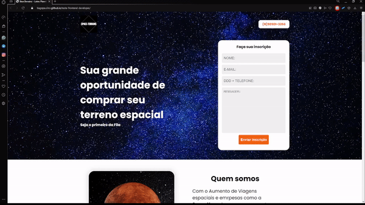

# SpaceTerrains

        

        

    

# Sobre o Projeto - Teste para estágio Frontend 

Esse projeto foi desenvolvido para cumprir os requisitos do teste prático para a vaga de **Estágio Front-end** da empresa **Ellos Design**. Como o foco é a vaga de para o estágio, não foi incrementado PHP e Banco de dados.

## Sobre a Ellos Design

A **Ellos Design** é uma agência de marketing e criação de sites localizada em Guarulhos / SP. Somos uma empresa em constante evolução e sempre estamos abertos para pessoas que gostem de tecnologia e queiram trabalhar na área, mas que principalmente queiram aprender e crescer com a nossa empresa.

## O desafio

"Você deverá desenvolver uma landing page seguindo a estrutura Fornecida. Você pode utilizar os textos e imagens de sua preferência para a criação da página."

## Tecnologias utilizadas para este desafio

- HTML5
- CSS
- JavaScript (vanilla-tilt.js)

### Detalhe adicional

Embora tenha demorado para escolher um tema para o projeto, decidi efetuar algo mais **cômico**, seguindo uma linha de entrevista para vendedores a ideia de *vender um terreno na lua*, acredito que ficou convincente.

## O que Mostro nesse projeto

- Criatividade
- Metodologia BEM(css)
- Uso de Bibliotecas Externas (Tilt.js)
- Posicionamento avançado de CSS
- Noções de desing
- Organização de projetos
- Responsividade

## Aviso

Devido a qualidade de algumas imagens e efeitos aplicados a **performance** em alguns aparelhos pode ser prejudicada.
Recomendado o uso do Navegador Google Chrome.

## Como executar o projeto? 

Ao efetuar o download basta abrir o arquivo index.html no navegador de sua preferência. 

Porém, para uma experiência mais completa, recomendo acessar a página no github-pages.

**Clicando Aqui:** [SpaceTerrain](https://tiagopaulino.github.io/teste-frontend-developer/)

## Finalização do Teste/Projeto

A elaboração do projeto demorou aproximadamente 3 dias com 16 horas de trabalho. A parte mais difícil do projeto foi a elaboração do tema e design. Ainda estou desenvolvendo minhas habilidades de Copy. Foi um projeto divertido de trabalhar, onde estou bastante satisfeito com os efeitos e a ideia elaborada.

## Desafio Original:
[fork](https://github.com/Ellos-Design/teste-frontend-developer/fork) 
